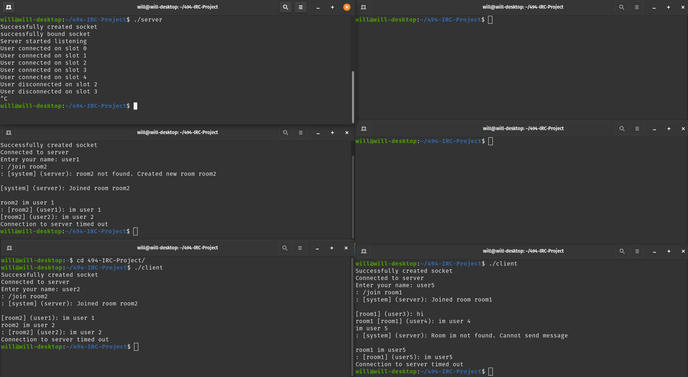

# 494-IRC-Project

## Setup

### Run Server
```
$ gcc structs.c server.c -o server
$ ./server
```

### Run Cliet
```
$ gcc structs.c client.c -o client
$ ./client
```
## Images
### All users connected


### All users joined a room
Users on the left joined room2 and users on the right joined room1.


### Send Messages
Users on the left sent and recieved messages in room2 and users on the right sent and revieved messages in room1.


### User Quit
The user at the top-right ran the quit command.


### User Crash
The user at the middle-right terminalted the client program.


### Server Crash
The server (top-left) terminated the server program.

